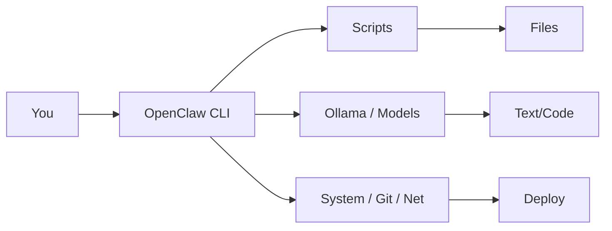
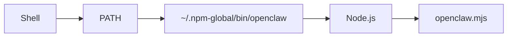
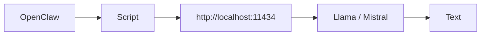

> **定位**：高密度、可执行、可扩展的极客博客
> **目标**：把 OpenClaw 变成你的「系统入口」

---

## 🗺️ 全局地图（先看这个）



---

# ① 认知篇：它不是工具，是入口

> **一句话**：OpenClaw = 把复杂流程压成一条命令

### 传统 vs CLI

| 方式 | 行为 | 特点 |
|---|---|---|
| GUI | 点点点 | 低效 / 不可复用 |
| CLI | `openclaw xxx` | 可脚本 / 可组合 |

### 核心能力

```bash
openclaw deploy     # 一键部署
openclaw blog       # 生成文章
openclaw analyze    # 分析数据
```

> 🧠 **认知升级**：你不是在“用软件”，而是在“调用系统能力”

---

# ② 系统篇：它是怎么跑起来的

## 执行链



## 目录结构

```
~/.npm-global/
├── bin/openclaw
└── lib/node_modules/openclaw
```

## 四要素（记住就不会炸）

- **Node**：引擎
- **npm**：下载
- **PATH**：路由
- **symlink**：指针

## 标准安装（用户级）

```bash
sudo pacman -S nodejs npm
mkdir -p ~/.npm-global
npm config set prefix '~/.npm-global'
echo 'export PATH="$HOME/.npm-global/bin:$PATH"' >> ~/.bashrc
source ~/.bashrc
npm install -g openclaw
```

## 快速自检

```bash
which openclaw
ls -l $(which openclaw)
node -v && npm -v
```

> ⚠️ **90% 报错模型**：PATH / symlink / 权限 / Node 版本

---

# ③ 爆点篇：OpenClaw + Ollama（本地 AI）

## 架构



## 环境

```bash
sudo pacman -S ollama
ollama serve
ollama pull llama3
ollama run llama3
```

## 最小可用脚本（ask）

```bash
#!/usr/bin/env bash
prompt="$*"
curl http://localhost:11434/api/generate \
  -d "{\"model\":\"llama3\",\"prompt\":\"$prompt\"}" \
  | jq -r '.response'
```

```bash
chmod +x ~/scripts/openclaw-ask.sh
```

## 使用

```bash
openclaw ask "解释 btrfs"
cat note.md | openclaw summarize
```

## 组合（Unix 哲学）

```bash
cat logs.txt | openclaw analyze | grep error | less
```

> 🚀 **关键跃迁**：AI 从“网页工具”→“系统能力”

---

# ④ 高阶篇：构建你的 CLI 系统

## 命令设计

```bash
openclaw blog
openclaw deploy
openclaw summarize
openclaw sync
```

> 原则：**短名 / 单一职责 / 可组合**

## 示例：一键部署

```bash
#!/usr/bin/env bash
npm run build
git add .
git commit -m "update"
git push
```

## 流水线（从内容到上线）


## 定时 / 实时

```bash
# 每小时生成报告
0 * * * * openclaw report

# 实时监控
watch -n 10 openclaw monitor
```

## 最终形态

```
命令 → 触发 → 自动执行 → AI参与 → 输出
```

> ⚫ **终极状态**：OpenClaw + AI + CLI = 你的个人操作系统

---

# 🧱 可复制模板（直接用）

## 目录约定

```
~/openclaw/
├── bin/        # 命令入口
├── scripts/    # 具体逻辑
└── config/     # 配置
```

## 统一入口（示例）

```bash
#!/usr/bin/env bash
cmd="$1"; shift
case "$cmd" in
  ask) ~/scripts/openclaw-ask.sh "$@" ;;
  blog) ~/scripts/openclaw-blog.sh "$@" ;;
  deploy) ~/scripts/openclaw-deploy.sh "$@" ;;
  *) echo "Unknown command" ;;
esac
```

---

# 🧠 设计原则（精简版）

- **小而美**：一个命令只做一件事
- **可组合**：永远支持管道
- **无状态优先**：输入→输出，避免副作用
- **文本为王**：一切尽量走 stdin/stdout

---

# 🧾 快速排错卡片

```bash
# 找不到命令
which openclaw

# 查看指向
ls -l $(which openclaw)

# npm 全局路径
npm root -g && npm bin -g

# 一键重置
npm uninstall -g openclaw
rm -rf ~/.npm-global/lib/node_modules/openclaw
rm -f ~/.npm-global/bin/openclaw
npm cache clean --force
npm install -g openclaw
```

---

# 🎯 收官

> **OpenClaw 不是终点，它只是入口。**

当你开始用：

```bash
openclaw something
```

你在做的其实是：

- 编排系统能力
- 调度 AI
- 自动化你的工作流

👉 这就是从“用电脑”到“构建系统”的分界线。

